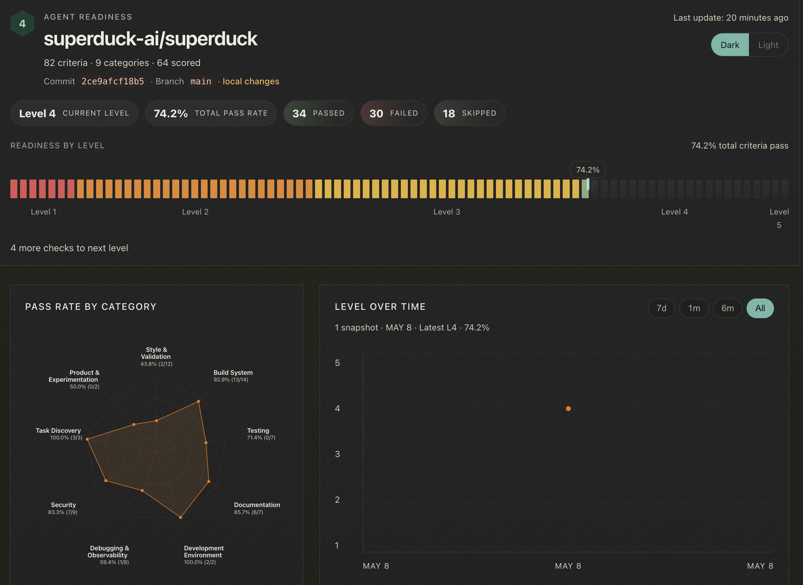
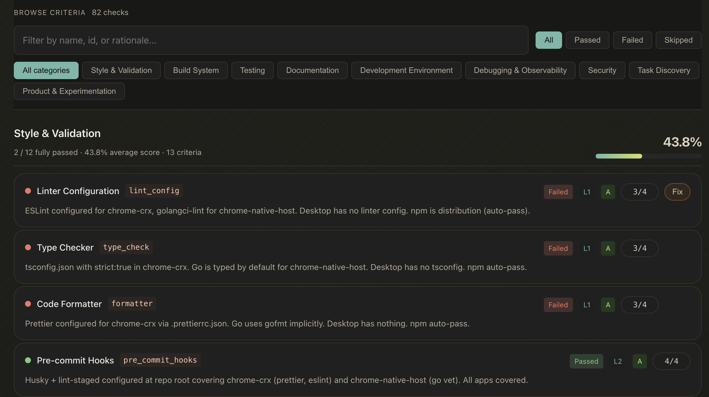
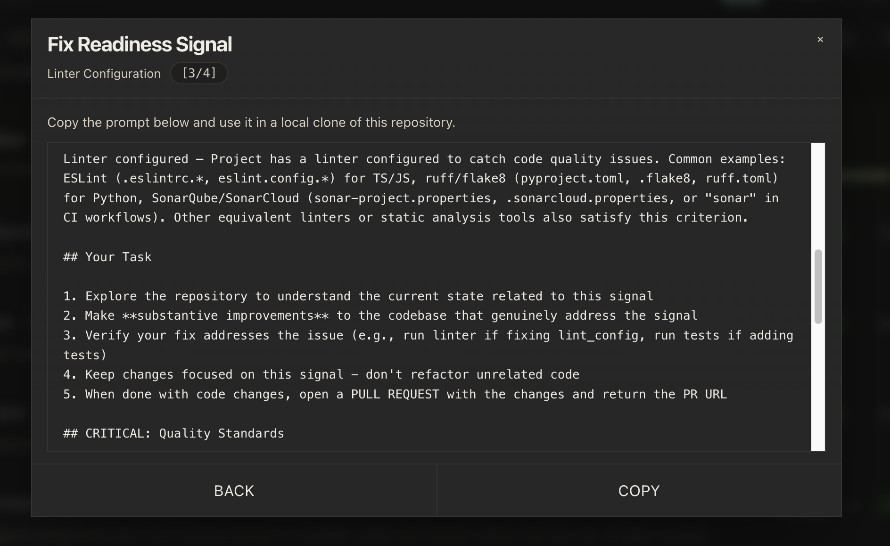

# agent-readiness

> Chinese version: [README.zh-CN.md](README.zh-CN.md)

A portable agent-readiness audit skill: scans a git repository, evaluates 82
criteria across 9 categories via parallel subagents, and emits a JSON
report, persistent score history, and an HTML dashboard.

## Layout

- `agent-readiness/` — **the skill**; the publishable artifact
  - `SKILL.md` — the agent prompt (5-phase audit workflow)
  - `criteria/` — 9 markdown files, one per category, read by Phase-3 subagents
  - `bin/agent-readiness.mjs` — bundled, self-contained CLI used by Phases 4–5
- `cli/` — dev workspace that produces `agent-readiness/bin/agent-readiness.mjs`

## Installing the skill

Copy or symlink `agent-readiness/` into your host's skills directory:

```sh
cp -r agent-readiness ~/.claude/skills/
```

The skill is fully self-contained — the bundled `bin/agent-readiness.mjs` has
no external runtime dependencies beyond Node.js ≥ 18.17.

## Running the audit

Inside any git repository, ask the host to invoke the skill (e.g. via slash
command or by referencing `SKILL.md`). The skill drives the entire 5-phase
workflow itself and writes its artifacts to a repo-local `.agent-readiness/`
directory:

```text
.agent-readiness/
├── .gitignore
├── history/
│   ├── .gitkeep
│   └── *.json
└── latest/
    ├── agent-readiness-report.json
    ├── agent-readiness-score.json
    └── agent-readiness-dashboard.html
```

Recommended git behavior:

- Commit `.agent-readiness/history/*.json` so trend data is reviewable and durable.
- Ignore `.agent-readiness/latest/` because those files are local, disposable, and fully reproducible from the latest run plus history.
- A nested `.agent-readiness/.gitignore` works well for this and keeps the repo root `.gitignore` clean.
- The skill bootstraps `.agent-readiness/.gitignore` with `latest/` and ensures `.agent-readiness/history/.gitkeep` exists on first run.

## Factory Overview Supplement

This repository maps directly to the Factory Agent Readiness reporting flow: a
static audit produces a raw report, a scored summary, and a browsable HTML
dashboard.

- `agent-readiness-report.json`: raw criterion evaluations
- `agent-readiness-score.json`: computed score, current level, and history input
- `agent-readiness-dashboard.html`: a visual dashboard for exploring the latest snapshot

The current implementation evaluates 82 criteria across 9 categories:

- Style & Validation
- Build System
- Testing
- Documentation
- Development Environment
- Debugging & Observability
- Security
- Task Discovery
- Product & Experimentation

Each criterion stores more than a simple pass or fail:

- status: `passed`, `failed`, `skipped`, or `missing`
- score: `numerator / denominator`
- rationale: the evidence-backed explanation shown in the dashboard

For application-scoped criteria, a score like `3/4` means 3 applications pass
out of 4 discovered applications. For repository-scoped criteria, the common
case is `1/1` or `0/1`.

### Reading the overview dashboard



Read the overview page in this order:

- repository context: name, commit, branch, and flags like `local changes`
- overall readiness: current level and total pass rate
- outcome mix: counts for `Passed`, `Failed`, and `Skipped`
- `Readiness by level`: one segment per criterion, with the marker showing current overall progress
- `Pass Rate by Category`: a radar view of strong and weak categories
- `Level Over Time`: trend data loaded from `.agent-readiness/history/*.json`

In practice, this page answers three questions quickly:

- What level is the repository at right now?
- Which categories are currently the weakest?
- Is readiness improving over time?

### Reading the criteria browser



The criteria browser is where you drill from the overall score down to a
specific signal.

The most useful elements are:

- the search box for criterion name, id, or rationale
- status filters: `All`, `Passed`, `Failed`, and `Skipped`
- category filters for all 9 categories
- the category summary line, such as `2 / 12 fully passed · 43.8% average score · 13 criteria`

You can read a single criterion row like this:

- `L1`, `L2`, and so on indicate the readiness level for that criterion
- `A` means application scope, while `R` means repository scope
- `Skippable` means the criterion may legitimately resolve to `N/A`
- `3/4` means 3 of 4 applications passed
- `N/A` means skipped
- `—` means the report has no entry for that criterion
- `rationale` is the most important field because it explains why the result was assigned

When prioritizing work, the highest-value first fixes are usually:

- failed application-scoped criteria with a large denominator
- Level 1 or Level 2 criteria that affect everyday developer workflow
- repository-scoped criteria that improve all apps at once

### Using the Fix flow



When a criterion is `failed` or `missing`, the dashboard exposes a `Fix`
button. Clicking it opens a modal with a copyable remediation prompt.

That prompt includes:

- the failing signal name, score, and description
- the original evaluation instructions used to grade the signal
- a focused task list: inspect the repository, implement a substantive fix, then verify it
- quality guardrails that reject placeholder files, disabled checks, or metric-gaming changes
- a completion requirement to open a PR and return the PR URL after code changes

In this repository, the copied prompt is intentionally written for use in a
local clone, so a failed signal can turn directly into an actionable
remediation task.

## Working on the CLI

```sh
cd cli
npm install
npm test
npm run bundle    # → ../agent-readiness/bin/agent-readiness.mjs
```

See [`cli/README.md`](cli/README.md) for details.
